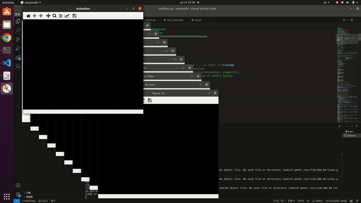

# Autonomous Quadrotor Navigation System (AQNS)

### Demo 

  
  

### Project Overview

This project aims to develop an autonomous quadrotor system capable of navigating unknown environments through path planning, trajectory optimization, control, and state estimation. By integrating various algorithms and techniques, the project successfully achieves autonomous flight in complex environments.

#### Path Planning

For path planning, the project utilized **Dijkstra's algorithm** and the **A* algorithm** to determine the shortest and most efficient paths in a 3D environment. **Dijkstra's algorithm** was employed to explore all possible paths from the start to the goal position, ensuring the discovery of the optimal path while avoiding obstacles. To enhance efficiency, the **A* algorithm** was used, incorporating a heuristic function—typically the Euclidean distance to the goal—which guided the search process. This heuristic significantly reduced the search time by prioritizing paths more likely to reach the goal quickly. Various complex maps were generated in a simulated environment to test these algorithms, demonstrating their ability to plan collision-free paths effectively.

#### Trajectory Optimization

Trajectory optimization was achieved using **minimum jerk** and **minimum snap polynomials**. These techniques generated smooth flight paths, essential for maintaining quadrotor stability. The **minimum jerk polynomial** minimized the rate of change of acceleration (jerk), producing smoother motion by reducing abrupt changes in trajectory. This method ensured the quadrotor could follow the path without sharp turns, which could lead to instability. The **minimum snap polynomial** further refined the trajectory by minimizing the rate of change of jerk (snap), creating even smoother paths. This refinement was crucial for precise and efficient flight, allowing the quadrotor to follow the planned trajectory seamlessly.

#### Control

The control system was designed using an **SE3 controller**, responsible for managing the quadrotor's position and orientation in three-dimensional space. The **SE3 controller** stabilized the quadrotor's motion, correcting any deviations from the planned trajectory. By providing robust control over the quadrotor's pose, the **SE3 controller** ensured accurate trajectory tracking. This implementation was essential for maintaining stable flight, allowing the quadrotor to execute complex maneuvers while adhering closely to the planned path. The controller's effectiveness was validated through extensive testing in various simulated environments, demonstrating its ability to maintain stability and precision.

#### State Estimation

State estimation integrated **complementary filtering** and **Visual Inertial Odometry (VIO)** using an **Error State Kalman Filter (ESKF)**. The **complementary filter** combined six-axis IMU data (accelerometer and gyroscope) to provide reliable attitude estimation, leveraging the short-term accuracy of the gyroscope and the long-term stability of the accelerometer. For pose estimation, **VIO** fused stereo vision and IMU data, utilizing the **ESKF** to process and integrate these measurements in real-time. The **RANSAC algorithm** was applied to the visual data to identify and reject outliers, enhancing the robustness and accuracy of the pose estimation. This comprehensive approach to state estimation ensured the quadrotor's attitude and position were accurately tracked, even in the presence of sensor noise and data outliers.

### Final Outcome

The project culminated in an autonomous quadrotor system capable of navigating unknown environments without GPS. By integrating **path planning**, **trajectory optimization**, **control**, and **state estimation** algorithms, the quadrotor can autonomously plan paths, avoid obstacles, and maintain stable flight. The system's real-time state estimation capabilities ensure accurate attitude and position data throughout the flight. This successful integration demonstrates the feasibility of autonomous flight technology, providing a valuable reference for future research and practical applications.
